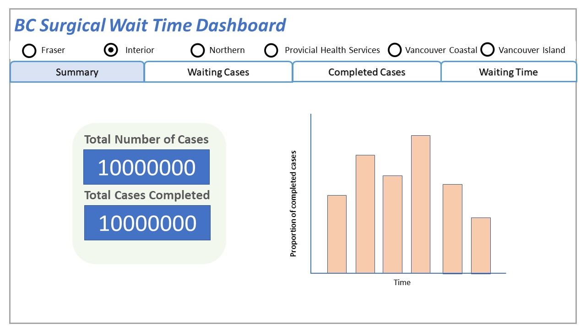
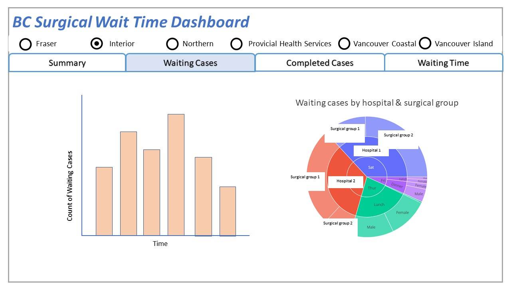
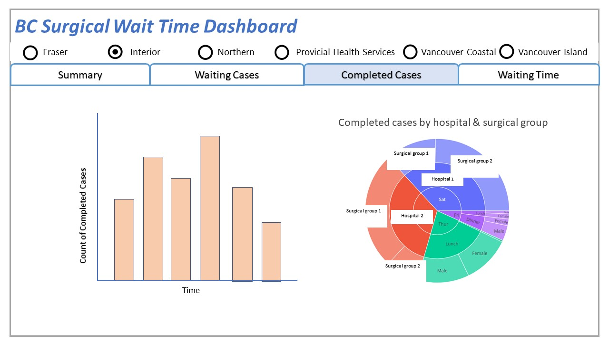
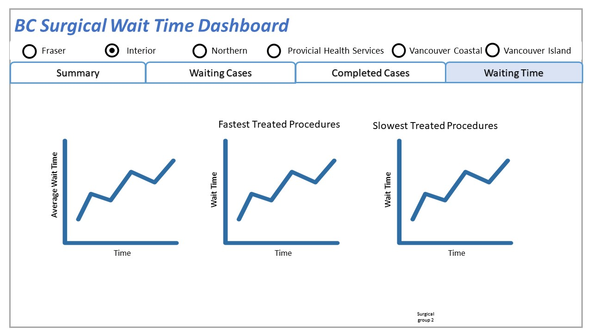

# {Surgical System Visualization Application} (Group F)

**Problem this dashboard hopes to solve**: Through interactive graphical and numeric visualizations, the proposed application will be designed to:  
1) Assess historical and current surgical resource/demand relationships in an effort to proactively secure future health care personal, infrastructure and funding.
2) Support development of the Fraser Health 2022/23 Surgical Funding Proposal for the upcoming BC Ministry of Health Resource Allocation Meeting. 
3) Review the impact of Covid-19 on surgical demand and throughput.   
4) Identify surgical procedures within the Fraser Health Authority that are exceeding surgical wait-time benchmarks.

## Team Members

- Anqi Li: I like to try new things and want to do something creative :)
- Andrew Nguyen: I never give up.
- Monica Penner: My current-self despises working out but I still exercise because I know my future-self will be grateful.
- Kevin Radford: I'm a good problem solver.

## Describe your topic/interest in about 150-200 words

#### Surgical Wait Times
It is well documented that surgical delays are associated with negative medical outcomes. [[1],](https://www.ncbi.nlm.nih.gov/pmc/articles/PMC4582239/)[[2],](https://journals.lww.com/spinejournal/Abstract/2019/04010/Immediate_Versus_Delayed_Surgical_Treatment_of.6.aspx)[[3]](https://www.cmaj.ca/content/182/15/1609.short) In an effort to minimize these effects, surgical wait time benchmarks have been established and are monitored across the province of BC for several surgical procedures.[[4],](https://www2.gov.bc.ca/gov/content/health/accessing-health-care/surgical-wait-times/understanding-wait-times/wait-time-targets)[[5],](https://www.cihi.ca/en/wait-time-metadata)[[6]](https://www.waittimealliance.ca/benchmarks/) The dataset accessed for this report was purpose built to facilitate evaluation of surgical demand by monitoring wait lists and wait times and surgical efficiencies by tracking completed surgical cases. 

#### Impact of Covid-19
The Covid-19 Pandemic has been found to have had a profound impact on the health care system.[[7],](https://www.cihi.ca/en/covid-19-resources/impact-of-covid-19-on-canadas-health-care-systems/the-big-picture)[[8],](https://journals.plos.org/plosone/article?id=10.1371/journal.pone.0253875)[[9]](https://academic.oup.com/intqhc/article/33/1/mzaa158/6018446?login=true)  Public Health measures in BC have been implemented to maintain healthcare operations with a continued focus on surgical throughtput. Despite these efforts, surgical delays and cancellations have occurred across the province periodically since early 2020. [[10]](https://bc.ctvnews.ca/staffing-crisis-forces-reduced-hours-at-b-c-hospitals-cancelled-surgeries-1.5746178), [[11]](https://www2.gov.bc.ca/assets/gov/health/conducting-health-research/surgical-renewal-plan.pdf) 

#### Surgical Efficiency
Improving surgical efficiency and maximizing surgical completion counts has been at the forefront of healthcare discourse in BC for over a decade.[[12],](https://www.doctorsofbc.ca/sites/default/files/enhancingsurgicalcare_web.pdf)[[13]](https://bcpsqc.ca/improve-care/surgery/)  Surgical case completions has been used as a blunt metric for surgical efficiencies. [[14]] (https://www.researchgate.net/publication/347888026_Operating_Room_Efficiency_measurement_made_simple_by_a_single_metric)

## About this Dashboard

The app uses six radio buttons to delivery corresponding information for the six health authorities. We designed two tabs to display of our data and variables. The first tab provides summarized information, which contains two cards showing the total number of waiting and completed cases, and also the proportion of completed cases by time. This tab would help healthcare administrators visualize changes and see if their actions at certain point is associated with changes in surgical demand. The second tab shows information about waiting cases, including number of waiting cases by time, by different hospitals and by surgical groups. The third tab shows information about completed cases, including number of completed cases by time, by different hospitals and by surgical groups. The fourth tab shows information related to surgical waiting time, including average waiting time and waiting time by procedures. This in particular would provide insight to the healthcare administrators about the procedures that require attention such as an increased allocation of more human, infrastructure and financial resources. 
| | |
|:-------------------------:|:------------------------:|
 | 
 | 

## Describe your dataset in about 150-200 words

The proposed application will visualize British Columbia surgical related data contained within the historic 2009 to 2021 and the current 2021/22 BC Surgical Wait Time databases. Data points are collected for all surgical procedures performed in all hospital facilities across the province.  Hospitals are additionally grouped by their respective Health Authorities.  Both datasets contain the number of patients waiting for surgery (waiting), number of completed surgical procedures (completed) and the 50th and 90th percentile surgical wait times in weeks (completed_50th_percentile and completed_90th_percentile, respectively). The data is for elective surgical procedures for patients of all ages and includes scheduled inpatient and day surgery cases. This data does not include unscheduled surgical cases. The data points are aggregated on a quarterly basis. Additionally the datasets contain summation data for all procedures, all hospitals and all health authorities. Using this data, the proposed app will also visualize new variables for predicted future wait list and surgical completion counts as well as anticipated wait-times (projected_wait_list, projected_completed, projected_wait_time).  Please refer to the accompanying [EDA.ipynb](https://github.com/ubco-mds-2021-labs/dashboard1-group-f/blob/main/EDA.ipynb) for a more in depth exploration and analysis of the datasets.

## Acknowledgements and references 

